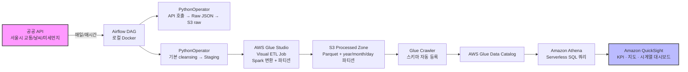
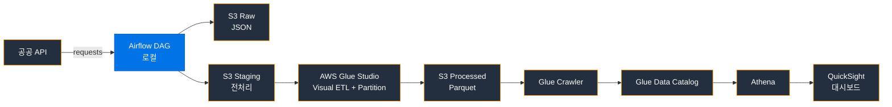

# BI-Data-Analysis
공공데이터 수집 활용 및 시각화

# BI 데이터 파이프라인 포트폴리오 프로젝트  
**공공 API → 자동 ETL → AWS 네이티브 분석 & 대시보드**

서울시 실시간 교통·날씨·미세먼지 데이터를 활용한  
**현대적 서버리스 BI 파이프라인** (2025년 기준 취업/이직용 강력 추천 구성)

## 프로젝트 개요

공공데이터 API를 매일 자동 수집 → 전처리 → 변환 → 저장 → 카탈로그화 → 분석 → 시각화하는  
**완전 자동화된 end-to-end BI 파이프라인**을 구축합니다.

### 핵심 기술 스택
- **오케스트레이션**      : Apache Airflow (로컬 Docker)
- **데이터 수집/기본 처리** : Python (requests, pandas)
- **ETL (본격 변환)**      : **AWS Glue Studio** (Visual ETL, Spark 기반)
- **저장소**               : Amazon S3 (raw → staging → processed, Parquet + 파티션)
- **메타데이터 관리**      : AWS Glue Crawler + Data Catalog
- **분석 엔진**            : Amazon Athena (Serverless SQL)
- **BI 대시보드**          : Amazon QuickSight (인터랙티브 대시보드)

### 전체 아키텍처 다이어그램

### 상세 데이터 흐름 (단순)

